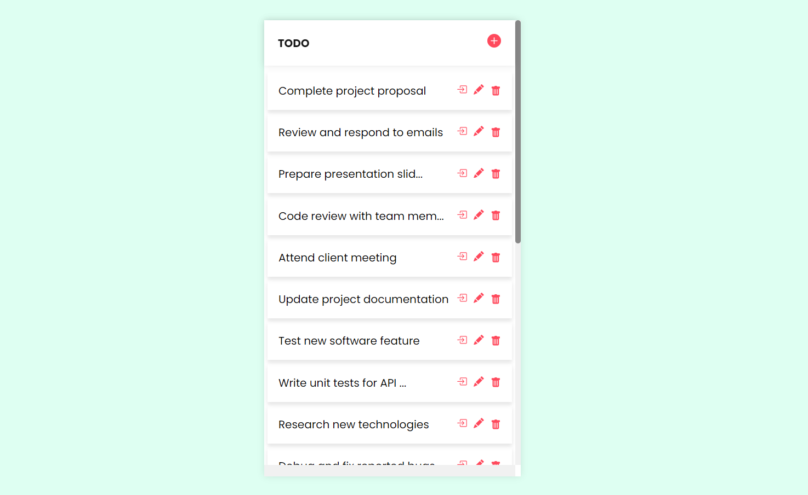

# React Todo App



## Installation Instructions

1. Clone this respository

```
git clone https://github.com/mycodingx/react-todo.git
```

2. Go inside the project directory

```
cd react-todo
```

3. Install all the dependencies

```
npm install
```

4. Run the project

```
npm run dev
```

Now you can modify the code as per your requirements.

Note: Currently we are loading the dummy data from [data.json] file in src directory. All the CRUD operations are working but you migth not see the add and edit data in your list. We are planning that to be available with a [NodeJS] backend till the we are outputting the data modifications in the console.
